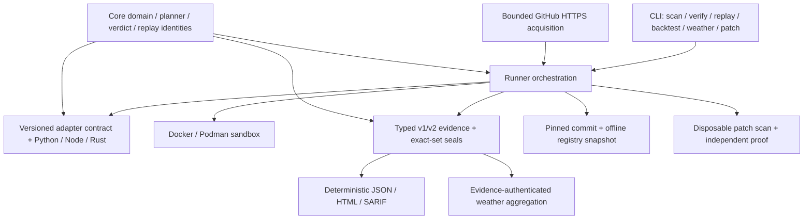

# Architecture

## Core principles

1. **Typed claims** — verdicts, attempts, replay qualification, snapshots, and
   proof dispositions are enums and strict schemas rather than parsed terminal
   prose.
2. **Data-only adapters** — adapters emit environment and argv structures; the
   host validates their negotiated contract and safety before every original
   or recorded execution.
3. **Container-only target execution** — target commands execute through
   Docker or Podman with explicit resources and fetch/test network separation.
4. **Verify before consume** — a retained inventory generation binds every
   later typed read. Reports, replay, policy, comparison, weather, backtest, and
   Patch Lab do not trust an unverified run directory.
5. **One final seal** — normal producers finish all writers before sealing.
   Post-seal commands do not append to or reseal a run.
6. **Non-green stays non-green** — BLOCKED, UNSUPPORTED, INCONCLUSIVE, flaky,
   target failure, and policy failure have distinct outcomes and exit codes.

## Crate map

| Crate | Responsibility |
|---|---|
| `tomorrowci-core` | Strict domain types, configuration, planner, verdict authorization, exact replay, backtest, weather, and patch models |
| `tomorrowci-sandbox` | Engine detection, immutable image resolution, disposable workspace checks, and Docker/Podman execution |
| `tomorrowci-adapters` | Versioned adapter contract, capability negotiation, safety validator, and conformance kit |
| `tomorrowci-adapter-*` | Built-in pip, npm, and Cargo implementations |
| `tomorrowci-runner` | Remote/local acquisition and scan, replay, backtest, and Patch Lab orchestration |
| `tomorrowci-evidence` | Recursive inventories, generation-bound reads, semantic verification, replay receipts, and proof verification |
| `tomorrowci-report` | Deterministic JSON, SARIF, HTML, backtest, and weather renderers |
| `tomorrowci-measure` | Fixture/claim ledger and reproducible product acceptance harness |
| `tomorrowci` | User-facing CLI and exit-code contract |

## Normal scan and replay flow

1. Resolve a local path or acquire a canonical public GitHub HTTPS repository
   under time/byte limits. Remote source rejects credentials, redirects,
   submodules, LFS pointers, links/reparse entries, and incomplete trees.
2. Copy only regular source entries into a disposable workspace and capture an
   exact v2 source manifest.
3. Negotiate the adapter contract, detect the ecosystem, resolve the baseline,
   and plan an ordered bounded candidate set.
4. Resolve every image tag to a digest, execute the baseline and candidates,
   retain every original attempt, and replay a stable failure twice from fresh
   exact workspaces.
5. Authorize an observed frontier only when the baseline, order, failure,
   prior-pass, and recomputed replay-equivalence gates all hold.
6. Write scenarios, receipts, reports, and root identities, then perform the
   single recursive seal. `verify` recomputes the whole relationship without
   executing target code.
7. Public `replay` rechecks source bytes and adapter safety, then executes the
   recorded digest-pinned manifest in a fresh workspace without mutating the
   sealed run.

## Research extensions

- **Historical backtest** materializes exact Git commit blobs without export or
  checkout filters, stages a content-addressed registry snapshot, disables live
  registries, scans the point, and emits a separately sealed proof with the
  sealed run and complete snapshot required for independent internal readback.
  Repository bytes are not republished, so authenticating the source-manifest
  claim against the named commit remains a publication-provenance boundary.
- **Weather map** accepts opaque verified run generations at the evidence
  boundary and preserves the predeclared denominator, including unobserved and
  non-green units.
- **Patch Lab** validates a bounded unified diff, applies it only to an exact
  disposable source, scans/replays the result, and seals witnesses that let a
  verifier recompute the exact source delta and fail-to-pass scenario repair.

## Release trust chain

The release workflow first builds an untagged exact-default-SHA candidate on
Linux, Windows, and macOS, freezes one complete inventory and CycloneDX SBOM,
and attaches GitHub provenance. Project-operated external targets consume that
immutable candidate but do not count as independent evidence. Stable promotion
requires a detached, candidate-bound result from an independent maintainer or
auditor; the annotated tag then promotes the already audited bytes without a
rebuild, and three operating systems download and read them back before the
draft release becomes public.
