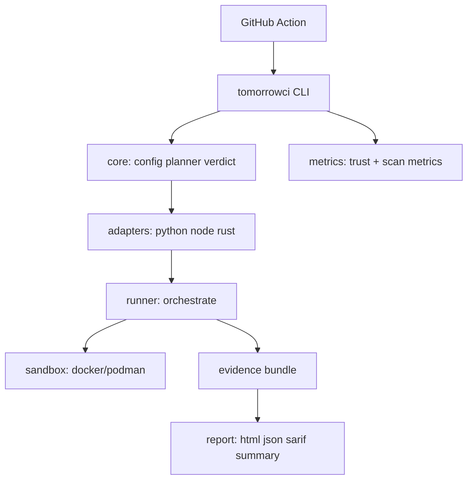

# Architecture diagram



## Trust boundary

```text
[ Developer host ] --CLI--> [ TomorrowCI trusted code ]
                                |
                                v
                         [ Container engine TCB ]
                                |
                                v
                         [ Untrusted target + packages ]
```
